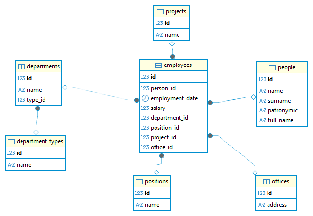
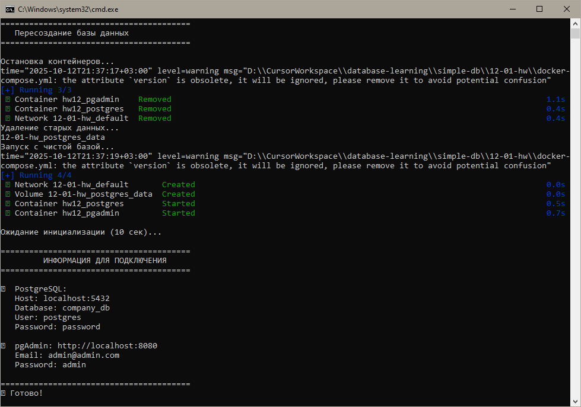

# Домашнее задание к занятию "Базы данных" - Ткачев Сергей

Заказчик передал файл в формате Excel с отчётом о сотрудниках компании: [hw-12-1.xlsx](Resources/hw-12-1.xlsx)
На основе этого отчёта создана реляционная база данных PostgreSQL.

## Схема базы данных



### Структура базы данных (7 таблиц)

1. **`people`** - Информация о людях
   - `id` (PRIMARY KEY) - Уникальный идентификатор
   - `name` - Имя
   - `surname` - Фамилия  
   - `patronymic` - Отчество
   - `full_name` - Полное имя

2. **`department_types`** - Типы подразделений
   - `id` (PRIMARY KEY) - Уникальный идентификатор
   - `name` - Название типа (Отдел, Группа, Департамент)

3. **`departments`** - Отделы компании
   - `id` (PRIMARY KEY) - Уникальный идентификатор
   - `name` - Название отдела
   - `type_id` (FOREIGN KEY → department_types.id) - Тип подразделения

4. **`positions`** - Должности
   - `id` (PRIMARY KEY) - Уникальный идентификатор
   - `name` - Название должности

5. **`projects`** - Проекты
   - `id` (PRIMARY KEY) - Уникальный идентификатор
   - `name` - Название проекта

6. **`offices`** - Офисы
   - `id` (PRIMARY KEY) - Уникальный идентификатор
   - `address` - Адрес офиса

7. **`employees`** - Сотрудники (центральная таблица)
   - `id` (PRIMARY KEY) - Уникальный идентификатор
   - `person_id` (FOREIGN KEY → people.id) - Ссылка на человека
   - `employment_date` - Дата трудоустройства
   - `salary` - Зарплата
   - `department_id` (FOREIGN KEY → departments.id) - Отдел
   - `position_id` (FOREIGN KEY → positions.id) - Должность
   - `project_id` (FOREIGN KEY → projects.id) - Проект
   - `office_id` (FOREIGN KEY → offices.id) - Офис


## Структура проекта

```
12-01-hw/
├── docker-compose.yml          # Docker конфигурация для PostgreSQL и pgAdmin
├── init.sql                   # SQL скрипт создания таблиц и связей
├── insert_data_simple.sql     # SQL скрипт заполнения реальными данными
├── start_db.bat               # Скрипт полного пересоздания базы данных
├── img/
│   ├── db_diagram.png         # Схема базы данных (ERD)
│   └── start_db_sample.png    # Скриншот работы start_db.bat
├── Resources/
│   └── hw-12-1.xlsx          # Исходный Excel файл от заказчика
└── README.md                  # Данный файл
```

### Описание файлов

- **`docker-compose.yml`** - Конфигурация Docker контейнеров:
  - PostgreSQL 15 с автоматической инициализацией
  - pgAdmin 4 для веб-интерфейса управления БД
  - Автоматический запуск SQL скриптов при создании БД

- **`init.sql`** - Создание структуры базы данных:
  - 7 таблиц с правильными связями
  - Первичные и внешние ключи
  - Комментарии к таблицам
  - Использование snake_case для названий

- **`insert_data_simple.sql`** - Заполнение базы реальными данными:
  - 29 сотрудников из исходного Excel файла
  - 16 отделов, 15 должностей, 27 проектов
  - 3 офиса в разных городах
  - Данные о зарплатах от 12,130 до 151,600 рублей

- **`start_db.bat`** - Удобный скрипт для Windows:
  - Полное пересоздание базы данных
  - Удаление старых данных
  - Запуск контейнеров
  - Вывод информации для подключения

- **`Resources/hw-12-1.xlsx`** - Исходный Excel файл от заказчика:
  - Отчёт о 30 сотрудниках компании
  - Содержит ФИО, должности, отделы, проекты, зарплаты
  - Основа для создания реляционной базы данных

## Инструкции по запуску

### Предварительные требования
- Docker и Docker Compose
- Windows (для использования .bat файла)

### Быстрый запуск

**Запустите базу данных одной командой:**
```cmd
start_db.bat
```



### Ручной запуск

**Шаг 1: Запуск контейнеров**
```cmd
docker-compose up -d
```

**Шаг 2: Ожидание инициализации**
Подождите 10-15 секунд для полной инициализации базы данных.

### Подключение к базе данных

**Через pgAdmin (веб-интерфейс):**
- URL: http://localhost:8080
- Email: admin@admin.com  
- Password: admin

**Через psql (командная строка):**
```cmd
docker exec -it hw12_postgres psql -U postgres -d company_db
```

**Параметры подключения:**
- Host: localhost
- Port: 5432
- Database: company_db
- Username: postgres
- Password: password